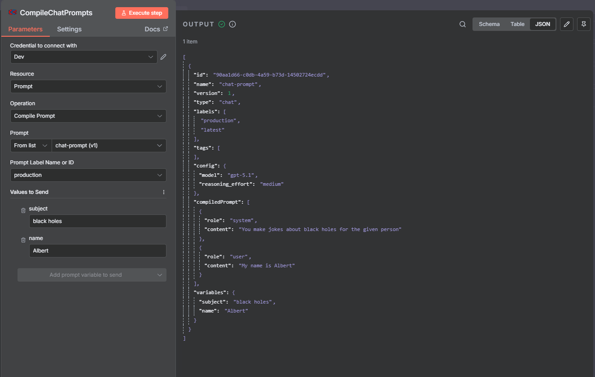

# n8n-nodes-langfuse

This is an n8n community node. It lets you use Langfuse in your n8n workflows.

[Langfuse](https://langfuse.com) is an open-source LLM engineering platform that provides observability, metrics, evaluations, prompt management and a playground.

[n8n](https://n8n.io/) is a [fair-code licensed](https://docs.n8n.io/reference/license/) workflow automation platform.

[Installation](#installation)  
[Operations](#operations)  
[Credentials](#credentials)
[Development](#development)  
[Resources](#resources)

## Installation

### Self-hosted n8n

Follow the [installation guide](https://docs.n8n.io/integrations/community-nodes/installation/) in the n8n community nodes documentation.

```bash
npm install @langfuse/n8n-nodes-langfuse
```

### n8n Cloud

This is a verified community node. Search for `Langfuse` to use this node in n8n Cloud.

## Operations

### Get Prompt

This node can be used to get a prompt from [Langfuse Prompt Management](https://langfuse.com/docs/prompts).

Steps

1. Enter the `name` of the prompt
2. Enter the `label` that identifies the prompt version that you want to fetch. Defaults to "production". Learn more about prompt labels in Langfuse [here](https://langfuse.com/docs/prompts/get-started#labels).

_Example workflow that retrieves the system prompt for the agent from Langfuse:_


### Compile Prompt

This operation retrieves a prompt from Langfuse and compiles it by substituting variables with your provided values. This is especially useful when you want to dynamically generate prompts with custom data before passing them to AI models.

Steps:

1. Select a prompt from the list or enter the prompt name manually
2. Choose the prompt label (e.g., "production", "staging") to specify which version to use
3. Fill in the prompt variables that are automatically detected from your Langfuse prompt template

The node will output:
- The compiled prompt with all variables substituted
- Metadata including prompt ID, name, version, type, labels, tags, and config
- The original variables you provided

#### Example: Compiling a text prompt

> Say hello to {{name}} and tell a joke about {{subject}}
 


#### Example: Compiling a chat prompt

> System: You make jokes about {{subject}} for the given person  
> User: My name is {{name}}



**Use Cases:**
- Generate personalized prompts for each item in your workflow
- Test different prompt variations by switching between labels
- Dynamically inject data from previous nodes into your prompt templates
- Maintain prompt version control through Langfuse while keeping your workflows flexible

## Credentials

To use this node, you need to authenticate with Langfuse. You'll need:

1. A Langfuse account, either [Langfuse Cloud](https://cloud.langfuse.com) or [self-hosted](https://langfuse.com/self-hosting).
2. API credentials from your Langfuse project settings: hostname, public key, secret key

## Development

### Prerequisites

You need the following installed on your development machine:

- [git](https://git-scm.com/downloads)
- Node.js and npm. Minimum version Node 20. You can find instructions on how to install both using nvm (Node Version Manager) for Linux, Mac, and WSL [here](https://github.com/nvm-sh/nvm). For Windows users, refer to Microsoft's guide to [Install NodeJS on Windows](https://docs.microsoft.com/en-us/windows/dev-environment/javascript/nodejs-on-windows).
- Install n8n with:
  ```
  npm install n8n -g
  ```
- Recommended: follow n8n's guide to [set up your development environment](https://docs.n8n.io/integrations/creating-nodes/build/node-development-environment/).

### Build new version

```bash
npm run build
npm link
```

### Test in local n8n

```bash
cd ~/.n8n/custom
npm link n8n-nodes-langfuse
```

## Resources

- [n8n community nodes documentation](https://docs.n8n.io/integrations/#community-nodes)
- [Langfuse documentation](https://langfuse.com/docs)
- [Langfuse Prompt Management](https://langfuse.com/docs/prompts)

## License

[MIT](https://github.com/langfuse/n8n-nodes-langfuse/blob/master/LICENSE.md)
